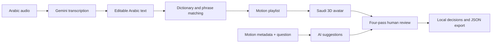

# Bayan | بيان

**Arabic speech, Saudi sign-language visualization, and a human review workspace.**

**من الصوت العربي إلى عرض الإشارات السعودية، في مساحة واحدة للمشاهدة والمراجعة.**

[English](#english) · [العربية](#العربية) · [Architecture](docs/ARCHITECTURE.md) · [File guide](docs/FILE_GUIDE.md) · [Development](docs/DEVELOPMENT.md) · [Motion fixes](docs/MOTION_FIXES.md)

## English

Bayan is a hackathon prototype combining Arabic audio transcription, dictionary-based motion retrieval, and a Saudi-dressed 3D avatar. Its unified workspace preserves the selected motion and draft notes while switching between sermon playback and individual motion review.

**Workspace:** [khutbah-sign.vercel.app](https://khutbah-sign.vercel.app/), using the project's configured Vercel sign-in settings.

### Features

- Record a microphone clip or upload audio, transcribe with Gemini, and edit the Arabic text.
- Prepare a motion playlist from text or open one of five saved sermons.
- Search the review catalog by Arabic label or exact numeric ID.
- Inspect four dimensions: joint motion, viewer clarity, source fidelity, and depth/contact.
- Save **accept**, **reject**, or **return for review** decisions with notes and a motion hash; export JSON.
- **Three sign banks** covering all 2,146 motions (the 1,148 used by the sermons plus the staged candidates):
  - **Trusted** (موثوق ومعتمد): the sermon motions (they keep playing) and every accepted motion. On the local server an accepted motion is copied into the playback library, its label is linked in `tools/approved.json`, and matching words in the saved sermons switch to it.
  - **Under review** (قيد المراجعة): new motions not yet compared with the source video, or returned for another comparison. Until accepted, a word whose only new sign is under review is fingerspelled in the player.
  - **Needs rework** (يحتاج مراجعة): rejected; must be rebuilt. Stored with an AI correction suggestion.

  A later decision undoes the earlier one. Records live in `tools/motion_bank.json`; deploy to publish. Rejecting a sermon motion does not remove it from playback.
- Ask the AI assistant for inspection suggestions grounded in the selected motion's metadata and your question.

The assistant is text-only: it does not see the animation or footage, and never changes review decisions. Technical checks, reviewer decisions, and linguistic validation serve distinct purposes.

### Pipeline



### Quick start

The web demo needs **Python 3**; its server uses the standard library. Node.js is used for checks. Extraction tools have separate dependencies.

```powershell
git clone https://github.com/iamghaid/bayan.git
cd bayan
python tools/demo_server.py
```

Open **http://127.0.0.1:8020/**. Text planning and saved sermons work without an AI key. To enable transcription and the review assistant, configure the server:

```powershell
$env:GEMINI_API_KEY = 'YOUR_SERVER_KEY'
$env:BAYAN_AUDIO_MODEL = 'YOUR_AUDIO_CAPABLE_MODEL_ID'
$env:BAYAN_REVIEW_MODEL = 'YOUR_TEXT_CAPABLE_MODEL_ID'
python tools/demo_server.py
```

Only `GEMINI_API_KEY` is required; both model variables are optional and default to `gemini-flash-latest`. The review model falls back to the audio model when omitted. Browser recordings are converted to 16 kHz WAV before upload. Transcription errors name the cause (missing or invalid key, unknown model, quota, provider outage). Set the same variables in Vercel for the hosted version. `.env.example` documents names; the server does not automatically load `.env` files. Keep credentials out of browser JavaScript and Git.

Audio uploads are limited to **4 MiB**; recording stops after **60 seconds**. Transcription sends audio to the provider only when requested. Review suggestions send the question and motion metadata, not source footage. On the hosted site, notes and decisions stay in the current browser until exported; only the local server writes the sign bank.

### Dataset snapshot

Development inventory on **5 October 2026**:

| Inventory | Count | Meaning |
| --- | ---: | --- |
| Dictionary entries | 8,818 | Source records, not distinct ready animations |
| Active motions | 1,148 | Main playback library |
| Staged motion files | 998 | Additional development review files |
| Unique active + staged IDs | 2,145 | One ID overlaps both sets |
| Saved sermons | 5 | Arabic texts and prepared plans |

Staged assets are excluded from Git. A fresh clone can run the active library; populate staging through extraction/audit for local review. Source footage and captured frames remain local. These counts describe data retrieval and extraction, not a completed model training run or measured translation accuracy.

### Validation

```powershell
python -m unittest discover -s tools -p 'test_*.py' -q
node tools/retarget_test.js
node --check review-assistant.js
node --check motion-review.js
node --check unified-view.js
```

Tests cover matching, planning, review metadata, API boundaries, provider-response handling, and retargeting regressions. `tools/avatarcheck.html` samples the actual GLB for visual review. Numerical checks complement source comparisons.

### Project rules

- **Demo, not a certified translation.** Output must be reviewed by a certified Saudi sign-language interpreter before it is shown to Deaf viewers.
- **Qur'an verses are shown as text.** Whether to sign them is a decision for a religious specialist.
- **Fix motions one at a time.** Corrections go in `signfix.js`, keyed by motion ID and frame window, after comparing with the reference. Never change motions that are already correct through a global rule. See [Motion fixes](docs/MOTION_FIXES.md).
- **Bump `?v=N`** on every changed browser script tag so viewers do not get a cached copy.
- **Keep Arabic files in UTF-8.** On Windows, edit them with a Python read-modify-write, not PowerShell `Get-Content`/`Set-Content` without `-Encoding UTF8`.

### Known limitations

- No facial expressions yet, although they carry grammar in sign language.
- About 9% of words are fingerspelled. «الرب» currently maps to the sign «الله» (`tools/approved.json`) and needs interpreter review.
- Motion 419 «النبي»: right hand sits higher and further out than the reference. Motion 589 needs wrist/overlap repair.
- Other motions may still show hand–hand penetration or missing face contact; fix them per motion.
- The shemagh back is flat and flares at the shoulders.

### Repository map

| Path | Responsibility |
| --- | --- |
| `index.html`, `workspace.js`, `unified-view.js` | Unified tabs and retained view state |
| `khutbah.html`, `khutbah.js`, `demo.js` | Arabic input, audio workflow and sermon playback |
| `motion-review.html`, `motion-review.js` | Four passes, decisions, notes and export |
| `review-assistant.js`, `tools/review_assistant.py` | Review assistant UI and grounded Gemini request |
| `signer.js`, `handfix.js`, `signfix.js` | Retargeting, tracking cleanup, per-motion fixes |
| `man_dress.js`, `avatar/`, `lib/` | Saudi presentation, model and rendering libraries |
| `api/` | Vercel HTTP entry points |
| `tools/` | Local servers, extraction, audits and tests |
| `sshi_motion/m/`, `translations/` | Active motions and saved sermon plans |
| `docs/` | Architecture, development, motion fixes and file guide |
| `.github/workflows/` | CI: unit tests, repository hygiene, retarget tests, script syntax |

### Sources

- [Saudi Sign Language Library](https://sshi.sa/): dictionary and motion references.
- [Alukah](https://www.alukah.net/): saved sermon text.
- [Terminology Encyclopedia](https://terminologyenc.com/ar): terminology links for meaning review.
- [Gemini](https://ai.google.dev/): transcription and AI suggestions.
- [MediaPipe](https://ai.google.dev/edge/mediapipe/solutions/guide): landmark extraction.
- [Three.js](https://threejs.org/): rendering; [MakeHuman](http://www.makehumancommunity.org/): avatar model (CC0).

Additional research inventories are in `coverage/research/`. Third-party components retain their attribution and license notices.

## العربية

**بيان** نموذج للهاكاثون يربط تفريغ الصوت العربي، واسترجاع الحركات من القاموس، وعرضها على أفتار بلباس سعودي. تجمع الصفحة الرئيسية الخطبة والصوت ومراجعة الحركات، وتحافظ على الاختيار والملاحظات أثناء التنقل.

### الاستخدام

1. افتح **الخطبة والصوت** وسجّل مقطعًا أو ارفع ملفًا، ثم اطلب تفريغه.
2. راجع النص، وأعدّ قائمة الإشارات، ثم شغّل العرض؛ أو اختر خطبة محفوظة.
3. افتح **مراجعة الحركات** وابحث بالاسم أو رقم الحركة.
4. افحص المفاصل والأصابع، والوضوح، والمطابقة للمصدر، والعمق والتلامس.
5. اختر **اعتماد الحركة** أو **رفض الحركة** أو **إعادة للمراجعة**، ودوّن ملاحظاتك. الحركات مقسمة على ثلاثة بنوك تختارها من «البنك» أعلى الصفحة: **موثوق ومعتمد** (اعتمدتها؛ على الخادم المحلي تنتقل إلى ترجمة الخطب مباشرة)، و**قيد المراجعة** (الحركات الجديدة التي لم تُقارن بفيديو المصدر بعد أو أُعيدت للمقارنة؛ الكلمة التي إشارتها الجديدة قيد المراجعة تُهجّى مؤقتًا حتى تُعتمد). حركات الخطب تبقى شغالة وتبدأ في «موثوق ومعتمد»، و**يحتاج مراجعة** (مرفوضة وتحتاج إعادة تصميم، مع اقتراح المساعد). انشر الموقع ليظهر التحديث للجميع.
6. اطلب اقتراحًا من **مساعد بيان للمراجعة**؛ القرار يبقى لك. صدّر السجل JSON لنقله إلى جهاز آخر.

### التشغيل والإعداد

```powershell
python tools/demo_server.py
```

افتح **http://127.0.0.1:8020/**. تشغيل النص والخطب لا يحتاج مفتاحًا. لتفريغ الصوت والمساعد يكفي ضبط `GEMINI_API_KEY` في بيئة الخادم (على Vercel: Settings ← Environment Variables ثم إعادة النشر). `BAYAN_AUDIO_MODEL` و`BAYAN_REVIEW_MODEL` اختياريان، والافتراضي `gemini-flash-latest`. رسالة الخطأ تحدد السبب: مفتاح مفقود أو غير صالح، نموذج غير متاح، تجاوز الحد، أو عطل عند المزوّد. الأوامر موضحة أعلاه.

حد الصوت **4 ميبيبايت** والتسجيل **60 ثانية**. الملاحظات محفوظة بالمتصفح، ولا تنتقل تلقائيًا بين الموقع والنسخة المحلية. المساعد يستقبل سؤالك وبيانات الحركة الفنية فقط؛ لا يشاهد الفيديو ولا يغيّر الحركة أو قرارها.

### قواعد المشروع

- **نموذج تجريبي وليس ترجمة معتمدة.** يجب أن يراجع المخرجات مترجم لغة إشارة سعودية معتمد قبل عرضها على الصم.
- **آيات القرآن تُعرض نصًا.** قرار ترجمتها بالإشارة يعود لمختص شرعي.
- **تصحيح الحركات واحدة واحدة.** التعديل في `signfix.js` برقم الحركة ونطاق الإطارات بعد المقارنة بالمرجع، ولا تُغيَّر الحركات السليمة بقاعدة عامة. التفاصيل في [تصحيح الحركات](docs/MOTION_FIXES.md).
- **حدّث `?v=N`** في وسوم السكربت بعد كل تعديل حتى لا يعرض المتصفح نسخة قديمة.
- **الملفات العربية بترميز UTF-8.** على ويندوز عدّلها عبر Python، لا عبر PowerShell بدون `-Encoding UTF8`.

### قيود معروفة

لا توجد تعابير وجه بعد، وهي جزء من قواعد لغة الإشارة. حوالي 9% من الكلمات تُهجّى بالأصابع. «الرب» مربوطة حاليًا بإشارة «الله» وتحتاج مراجعة مترجم. الحركة 419 «النبي» اليد اليمنى أعلى وأبعد من المرجع، والحركة 589 تحتاج إصلاح المعصم والتداخل. ظهر الشماغ مسطّح ويتسع عند الكتفين.

### البيانات والتنظيم

القاموس يحتوي **8,818 مدخلًا**، والتشغيل **1,148 حركة**، وبيئة المراجعة التطويرية **998 ملفًا**، بإجمالي **2,145 معرّفًا مختلفًا**. هذه أعداد بيانات وليست نتيجة تدريب نموذج أو نسبة دقة للترجمة.

يمكن للجنة البدء من مخطط النظام ثم [دليل الملفات](docs/FILE_GUIDE.md) والاختبارات. تفاصيل الخدمات في [دليل التطوير](docs/DEVELOPMENT.md).

**Developed by Gheid Abdulkarim / تطوير غيد عبد الكريم** · [GitHub](https://github.com/iamghaid) · [LinkedIn](https://www.linkedin.com/in/gheid-abdulkarim-6567872ab)
