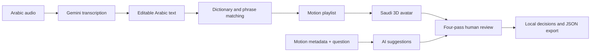

# Bayan | بيان

**Arabic speech, Saudi sign-language visualization, and a human review workspace.**

**من الصوت العربي إلى عرض الإشارات السعودية، في مساحة واحدة للمشاهدة والمراجعة.**

[English](#english) · [العربية](#العربية) · [Architecture](docs/ARCHITECTURE.md) · [File guide](docs/FILE_GUIDE.md) · [Development](docs/DEVELOPMENT.md)

## English

Bayan is a hackathon prototype combining Arabic audio transcription, dictionary-based motion retrieval, and a Saudi-dressed 3D avatar. Its unified workspace preserves the selected motion and draft notes while switching between sermon playback and individual motion review.

**Demo:** [Open the sermon workspace](https://khutbah-sign.vercel.app/khutbah.html). The hosted project is **`khutbah-sign`** in the **`gheid`** team; its server settings provide Gemini access.

### Reviewing the project

Start with the demo: open a saved sermon, prepare an Arabic text, then switch to motion review and search for **السكينة** (ID **1208**). To inspect the implementation, read [the architecture](docs/ARCHITECTURE.md), follow [the file guide](docs/FILE_GUIDE.md), and run the validation commands below. The player and API code are separate from generated motion data and research reports.

### Features

- Record a microphone clip or upload audio, transcribe with Gemini, and edit the Arabic text.
- Prepare a motion playlist from text or open one of five saved sermons.
- Search the review catalog by Arabic label or exact numeric ID.
- Inspect four dimensions: joint motion, viewer clarity, source fidelity, and depth/contact.
- Save **accept**, **reject**, or **return for review** decisions with notes and a motion hash; export JSON.
- Ask the AI assistant for inspection suggestions grounded in the selected motion's metadata and your question.

The assistant is text-only: it does not see the animation or footage, and never changes review decisions. Technical checks, reviewer decisions, and linguistic validation serve distinct purposes.

### Pipeline



### Quick start

The web demo needs **Python 3**; its server uses the standard library. Node.js is used for checks. Extraction tools have separate dependencies.

```powershell
git clone https://github.com/iamghaid/bayan.git
cd bayan
python tools/demo_server.py
```

Open **http://127.0.0.1:8020/**. Text planning and saved sermons work without an AI key. To enable transcription and the review assistant, configure the server:

```powershell
$env:GEMINI_API_KEY = 'YOUR_SERVER_KEY'
$env:BAYAN_AUDIO_MODEL = 'YOUR_AUDIO_CAPABLE_MODEL_ID'
$env:BAYAN_REVIEW_MODEL = 'YOUR_TEXT_CAPABLE_MODEL_ID'
python tools/demo_server.py
```

Use model IDs available in your Google AI project. The review model falls back to the audio model when omitted. Set the same variables in Vercel for the hosted version. `.env.example` documents names; the server does not automatically load `.env` files. Keep credentials out of browser JavaScript and Git.

Audio uploads are limited to **4 MiB**; recording stops after **60 seconds**. Transcription sends audio to the provider only when requested. Review suggestions send the question and motion metadata, not source footage. Notes and decisions stay in the current browser/origin until exported; localhost and Vercel records do not sync automatically.

### Dataset snapshot

Development inventory on **5 October 2026**:

| Inventory | Count | Meaning |
| --- | ---: | --- |
| Dictionary entries | 8,818 | Source records, not distinct ready animations |
| Active motions | 1,148 | Main playback library |
| Staged motion files | 1,018 | Additional development review files |
| Unique active + staged IDs | 2,165 | One ID overlaps both sets |
| Latest expansion | 20 | 15 added to hosted review; 5 held for contact inspection |
| Saved sermons | 5 | Arabic texts and prepared plans |

Staged assets are excluded from Git. A fresh clone can run the active library; populate staging through extraction/audit for local review. Source footage and captured frames remain local. These counts describe data retrieval and extraction, not a completed model training run or measured translation accuracy.

### Validation

```powershell
python -m unittest discover -s tools -p 'test_*.py' -q
node tools/retarget_test.js
node --check review-assistant.js
node --check motion-review.js
node --check unified-view.js
```

Tests cover matching, planning, review metadata, API boundaries, provider-response handling, and retargeting regressions. `tools/avatarcheck.html` samples the actual GLB for visual review. Numerical checks complement source comparisons.

### Repository map

The root keeps browser entry points together so local and hosted URLs match. Development scripts live in `tools/`; vendored rendering libraries live in `lib/`. See [development](docs/DEVELOPMENT.md) for the release procedure that verifies the Vercel project before publishing.

| Path | Responsibility |
| --- | --- |
| `index.html`, `workspace.js`, `unified-view.js` | Unified tabs and retained view state |
| `khutbah.html`, `khutbah.js`, `demo.js` | Arabic input, audio workflow and sermon playback |
| `motion-review.html`, `motion-review.js` | Four passes, decisions, notes and export |
| `review-assistant.js`, `tools/review_assistant.py` | Review assistant UI and grounded Gemini request |
| `signer.js`, `handfix.js`, `signfix.js` | Retargeting, tracking cleanup, per-motion fixes |
| `man_dress.js`, `avatar/`, `lib/` | Saudi presentation, model and rendering libraries |
| `api/` | Vercel HTTP entry points |
| `deployment.json`, `tools/deploy_release.py` | Selected hosting project and release target verification |
| `tools/` | Local servers, extraction, audits and tests |
| `sshi_motion/m/`, `translations/` | Active motions and saved sermon plans |
| `docs/` | Architecture and development guidance |

### Sources

- [Saudi Sign Language Library](https://sshi.sa/): dictionary and motion references.
- [Alukah](https://www.alukah.net/): saved sermon text.
- [Terminology Encyclopedia](https://terminologyenc.com/ar): terminology links for meaning review.
- [Gemini](https://ai.google.dev/): transcription and AI suggestions.
- [MediaPipe](https://ai.google.dev/edge/mediapipe/solutions/guide): landmark extraction.
- [Three.js](https://threejs.org/): rendering; [MakeHuman](http://www.makehumancommunity.org/): avatar model (CC0).

Additional research inventories are in `coverage/research/`. Third-party components retain their attribution and license notices.

## العربية

**بيان** نموذج للهاكاثون يربط تفريغ الصوت العربي، واسترجاع الحركات من القاموس، وعرضها على أفتار بلباس سعودي. تجمع الصفحة الرئيسية الخطبة والصوت ومراجعة الحركات، وتحافظ على الاختيار والملاحظات أثناء التنقل.

### الاستخدام

1. افتح **الخطبة والصوت** وسجّل مقطعًا أو ارفع ملفًا، ثم اطلب تفريغه.
2. راجع النص، وأعدّ قائمة الإشارات، ثم شغّل العرض؛ أو اختر خطبة محفوظة.
3. افتح **مراجعة الحركات** وابحث بالاسم أو رقم الحركة.
4. افحص المفاصل والأصابع، والوضوح، والمطابقة للمصدر، والعمق والتلامس.
5. اختر **اعتماد الحركة** أو **رفض الحركة** أو **إعادة للمراجعة**، ودوّن ملاحظاتك.
6. اطلب اقتراحًا من **مساعد بيان للمراجعة**؛ القرار يبقى لك. صدّر السجل JSON لنقله إلى جهاز آخر.

### التشغيل والإعداد

```powershell
python tools/demo_server.py
```

افتح **http://127.0.0.1:8020/**. تشغيل النص والخطب لا يحتاج مفتاحًا. لتفريغ الصوت والمساعد اضبط `GEMINI_API_KEY` و`BAYAN_AUDIO_MODEL`، واختياريًا `BAYAN_REVIEW_MODEL` في بيئة الخادم، باستخدام نماذج متاحة في حسابك. الأوامر موضحة أعلاه.

حد الصوت **4 ميبيبايت** والتسجيل **60 ثانية**. الملاحظات محفوظة بالمتصفح، ولا تنتقل تلقائيًا بين الموقع والنسخة المحلية. المساعد يستقبل سؤالك وبيانات الحركة الفنية فقط؛ لا يشاهد الفيديو ولا يغيّر الحركة أو قرارها.

### البيانات والتنظيم

القاموس يحتوي **8,818 مدخلًا**، والتشغيل **1,148 حركة**، وبيئة المراجعة التطويرية **1,018 ملفًا**، بإجمالي **2,165 معرّفًا مختلفًا**. آخر دفعة تضم 20 حركة: أُضيفت 15 للمراجعة على الموقع، وبقيت 5 لفحص التلامس. هذه أعداد بيانات وليست نتيجة تدريب نموذج أو نسبة دقة للترجمة.

### مسار سريع للجنة

افتح [صفحة الخطبة](https://khutbah-sign.vercel.app/khutbah.html)، وجرب خطبة محفوظة، ثم انتقل للمراجعة وابحث عن **السكينة — 1208**. لفهم الكود، اقرأ مخطط النظام ودليل الملفات وشغّل الاختبارات. مشروع النشر هو **khutbah-sign**؛ يراجع أمر النشر معرّف المشروع قبل رفع الملفات، لتبقى إعدادات Gemini مرتبطة بالموقع نفسه.

يمكن للجنة البدء من مخطط النظام ثم [دليل الملفات](docs/FILE_GUIDE.md) والاختبارات. تفاصيل الخدمات في [دليل التطوير](docs/DEVELOPMENT.md).

**Developed by Gheid Abdulkarim / تطوير غيد عبد الكريم** · [GitHub](https://github.com/iamghaid) · [LinkedIn](https://www.linkedin.com/in/gheid-abdulkarim-6567872ab)
