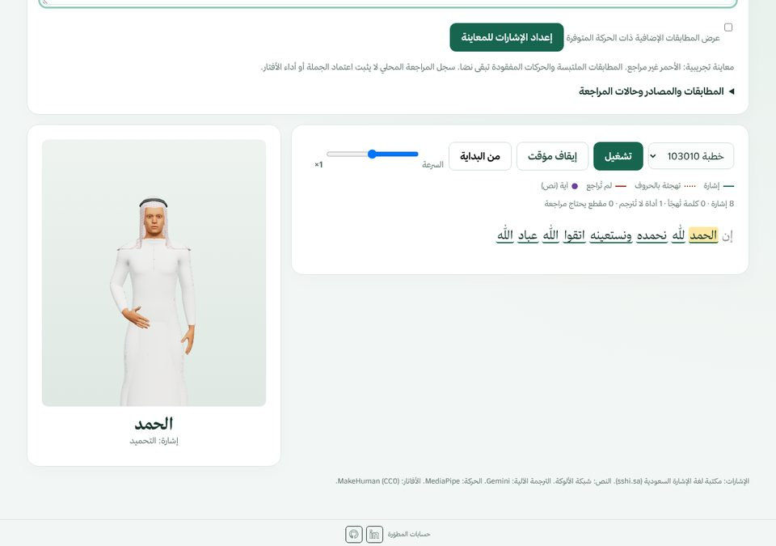
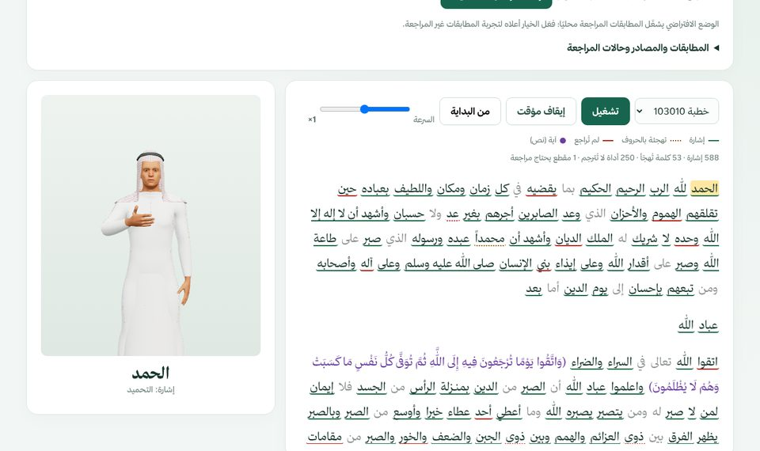
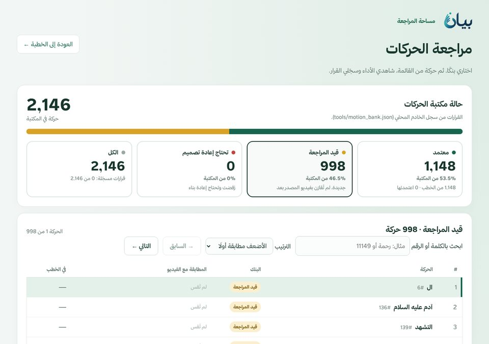
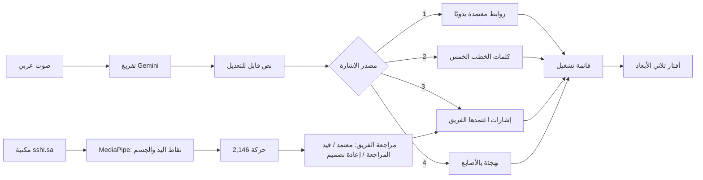

<p align="center">
  
</p>

<h3 align="center">من الكلام العربي إلى لغة الإشارة السعودية بأفتار ثلاثي الأبعاد<br>Arabic speech → Saudi Sign Language on a 3D avatar</h3>

<p align="center">
  <a href="https://bayan-gheid.vercel.app"><b>الموقع المباشر / Live site</b></a> ·
  <a href="#العربية">العربية</a> ·
  <a href="#english">English</a> ·
  <a href="docs/ARCHITECTURE.md">Architecture</a> ·
  <a href="docs/FILE_GUIDE.md">File guide</a>
  <br><br>
  <a href="https://github.com/iamghaid/bayan/actions/workflows/checks.yml"></a>
</p>

<p align="center">
  
</p>

---

## العربية

### الفكرة

خطبة الجمعة تصل لمعظم الناس بالصوت فقط، والصم يحتاجون مترجمًا حاضرًا في كل مسجد. **بيان** يحوّل الكلام العربي إلى إشارات من **مكتبة لغة الإشارة السعودية** يؤديها أفتار بلباس سعودي، ويعطي فريق المراجعة مساحة مشتركة لاعتماد كل إشارة قبل استخدامها.

> **نموذج تجريبي وليس ترجمة معتمدة.** المخرجات تحتاج مراجعة مترجم لغة إشارة سعودية معتمد قبل عرضها على الصم، والآيات تُعرض نصًا ويعود قرار ترجمتها لمختص شرعي.

### ماذا يفعل

| | |
| --- | --- |
| 🎙️ **من الصوت إلى الإشارة** | سجّل أو ارفع مقطعًا، يُفرَّغ بـ Gemini، تراجع النص، ثم يؤدي الأفتار الإشارات كلمة كلمة مع تمييز الكلمة الحالية. |
| 📖 **خمس خطب جاهزة** | خطب كاملة مترجمة مسبقًا. كل كلماتها (2,868 كلمة) صارت مصدرًا لأي تسجيل جديد. |
| 👥 **مراجعة الفريق** | كل المراجعين يرون نفس الأرقام والقوائم. الاعتماد أو الرفض يُحفظ للجميع باسم المراجع، والحركة التالية تفتح تلقائيًا. |
| ⚡ **الاعتماد يدخل الترجمة فورًا** | أي إشارة جديدة يعتمدها الفريق تُستخدم مباشرة في الترجمة الصوتية والنصية، بدون نشر. |
| 🎥 **مقارنة بالمصدر** | فيديو الإشارة الأصلي من sshi.sa بجانب أداء الأفتار، مع نسبة مطابقة الأفتار لبيانات الفيديو لكل حركة. |
| 🤖 **مساعد مراجعة** | اقتراحات تصحيح مبنية على بيانات الحركة؛ لا يشاهد الفيديو ولا يغيّر أي قرار. |

<p align="center">
  
  
</p>

### كيف يعمل



1. **المكتبة:** فيديوهات مكتبة لغة الإشارة السعودية تُحوَّل محليًا بـ MediaPipe إلى نقاط حركة (JSON). الفيديوهات لا تُرفع إلى أي مكان.
2. **الأفتار:** `signer.js` ينقل النقاط إلى هيكل الأفتار (Three.js)، و`handfix.js` ينظّف التتبع، و`signfix.js` يصحح حركات بعينها بعد مقارنتها بالمرجع.
3. **المطابقة:** الخادم يطابق كل كلمة بالترتيب أعلاه، ويُبقي الآيات نصًا.
4. **المراجعة:** قرارات الفريق محفوظة في قاعدة بيانات Neon، ويقرؤها الموقع والمترجم معًا.

### الأرقام

| | العدد |
| --- | ---: |
| مدخلات القاموس | 8,818 |
| حركات في المكتبة الأساسية (تستخدمها الخطب) | 1,148 |
| حركات جديدة قيد مراجعة الفريق | 998 |
| كلمات معروفة من الخطب الخمس | 2,868 |
| اختبارات آلية | 64 |

هذه أعداد بيانات، وليست نتيجة تدريب نموذج أو نسبة دقة للترجمة.

### مصدر البيانات والإذن

كل الإشارات مأخوذة من **[مكتبة لغة الإشارة السعودية (sshi.sa)](https://sshi.sa/)**: القاموس وفيديوهات الإشارات التي استُخرجت منها الحركات. **لدى الفريق إذن باستخدامها**: تواصلت معنا الرئيسة التنفيذية وأكدت أن البيانات متاحة للاستخدام العام. فيديوهات المصدر لا تُرفع إلى المستودع؛ يُنشر فقط ملف نقاط الحركة المستخرج منها، ويُعرض الفيديو الأصلي في صفحة المراجعة مباشرة من sshi.sa.

### التشغيل محليًا

يحتاج **Python 3** فقط (مكتبة قياسية):

```powershell
git clone https://github.com/iamghaid/bayan.git
cd bayan
python tools/demo_server.py
```

افتح **http://127.0.0.1:8020/**. الخطب والترجمة من النص تعمل بدون مفاتيح. للتفريغ الصوتي ومراجعة الفريق اضبط متغيرات البيئة في [`.env.example`](.env.example).

### على Vercel

| المتغير | الغرض |
| --- | --- |
| `GEMINI_API_KEY` | التفريغ الصوتي ومساعد المراجعة (إلزامي لهما) |
| `REVIEW_PASSWORD` | كلمة سر المراجعين لتسجيل القرارات |
| `DATABASE_URL` | قاعدة Neon لقرارات الفريق؛ يضيفها Vercel عند ربط Neon (يقبل البادئة مثل `bayan_DATABASE_URL`) |

### القيود المعروفة

- لا توجد تعابير وجه بعد، وهي جزء من قواعد لغة الإشارة.
- ترجمة الخطب أعدّها نموذج لغوي، وفيها مطابقات لم يراجعها مترجم معتمد بعد؛ وتُستخدم الآن في أي تسجيل، فالخطأ فيها يتكرر.
- حوالي 9% من كلمات الخطب تُهجّى بالأصابع. «الرب» مربوطة بإشارة «الله» وتحتاج مراجعة.
- الحركة 419 «النبي» والحركة 589 تحتاجان إصلاحًا. قد تظهر تداخلات بين اليدين في حركات أخرى.
- الخطب الخمس المحفوظة لا تتحدث تلقائيًا بالإشارات الجديدة؛ تحتاج مزامنة (`python tools/team_bank.py --apply`).

### خطة التطوير

**تعابير الوجه هي الخطوة القادمة.** في لغة الإشارة، الوجه جزء من القواعد وليس زينة: رفع الحاجبين يحوّل الجملة إلى سؤال، وهز الرأس ينفيها، وشكل الفم يغيّر معنى بعض الإشارات. اليوم يستخرج بيان من الفيديو درجة انفتاح الفم فقط. الخطة:

1. استخراج ملامح الوجه كاملة من نفس فيديوهات sshi.sa: الحاجبان، العينان، شكل الفم، وميل الرأس وحركته.
2. نقلها إلى وجه الأفتار حتى يؤدي التعبير مع حركة اليدين في نفس اللحظة.
3. إضافة الوجه كجانب خامس في مراجعة الفريق، يُقارَن بفيديو المصدر قبل الاعتماد.

---

## English

### The idea

Friday sermons reach most people only as sound; Deaf worshippers need an interpreter in every mosque. **Bayan** turns Arabic speech into signs from the **Saudi Sign Language library**, performed by a Saudi-dressed 3D avatar, and gives a review team one shared place to approve each sign before it is used.

> **A prototype, not a certified translation.** Output must be reviewed by a certified Saudi sign-language interpreter before it is shown to Deaf viewers. Qur'an verses are shown as text; signing them is a decision for a religious specialist.

### Features

- **Voice to sign:** record or upload audio, transcribe with Gemini, edit the text, and watch the avatar sign it word by word with the current word highlighted.
- **Five ready sermons:** fully prepared plans; all 2,868 of their word renderings are reused for any new recording.
- **Team review:** every reviewer sees the same banks and counts. Approvals and rejections are stored for everyone with the reviewer's name, and the next motion opens automatically.
- **Approval goes live:** a new sign accepted by the team is used immediately by voice and text translation, without a deploy.
- **Source comparison:** the original sshi.sa video next to the avatar, plus a per-motion avatar-vs-landmark match score.
- **Review assistant:** correction suggestions grounded in motion metadata; it does not see the video and never changes a decision.

### How it works

| Layer | Files |
| --- | --- |
| Landmark extraction (local, MediaPipe) | `tools/sshi_extract.py`, `tools/expand_batch.py` → `sshi_motion/m/`, `sshi_motion/staging/` |
| Retargeting and rendering (Three.js) | `signer.js`, `handfix.js`, `signfix.js`, `man_dress.js`, `avatar/man.glb` |
| Word → sign planning | `tools/demo_server.py` (`/api/plan`): approved links → sermon renderings → team-accepted signs → fingerspelling |
| Transcription and assistant | `api/transcribe.py`, `tools/review_assistant.py` (Gemini, server-side key) |
| Team review | `motion-review.*`, `tools/team_bank.py`, `api/bank.py`, `api/decision.py` (Neon Postgres over HTTPS) |

Details: [Architecture](docs/ARCHITECTURE.md) · [File guide](docs/FILE_GUIDE.md) · [Development](docs/DEVELOPMENT.md) · [Motion fixes](docs/MOTION_FIXES.md).

### Roadmap

**Facial expressions are next.** In sign language the face is grammar, not decoration: raised eyebrows turn a sentence into a question, a head shake negates it, and mouth shapes change the meaning of some signs. Today Bayan extracts only how open the mouth is. The plan:

1. Extract the full face from the same sshi.sa videos: eyebrows, eyes, mouth shape, and head tilt and movement.
2. Drive the avatar's face with it, in sync with the hands.
3. Add the face as a fifth pass in team review, compared with the source video before approval.

### Run locally

```powershell
git clone https://github.com/iamghaid/bayan.git
cd bayan
python tools/demo_server.py      # http://127.0.0.1:8020/
```

Sermons and text planning need no keys. See [`.env.example`](.env.example) for transcription and team review.

### Tests

```powershell
python -m unittest discover -s tools -p "test_*.py"   # 64 tests
python tools/repo_check.py                            # no secrets or source media
node tools/retarget_test.js                           # avatar retargeting
```

The same checks run on every push ([checks.yml](.github/workflows/checks.yml)).

### Data source and permission

All signs come from the **[Saudi Sign Language Library (sshi.sa)](https://sshi.sa/)**: its dictionary and the sign videos the motions were extracted from. **The team has permission to use this data**: the library's CEO contacted us and confirmed the data is available for public use. Source videos are not uploaded to this repository; only the derived landmark JSON is published, and the review page plays the original video directly from sshi.sa.

### Data and privacy

- Source videos and frames stay on the owner's computer (`.gitignore`, `tools/repo_check.py`). Only derived landmark JSON is published.
- API keys and the reviewers' password live in server environment variables only.
- Transcription sends audio to the provider only when requested; the assistant receives the question and motion metadata, never footage.

### Credits

- [Saudi Sign Language Library (sshi.sa)](https://sshi.sa/): dictionary and source videos, used with the library's permission for public use.
- [Alukah](https://www.alukah.net/): sermon texts.
- [Terminology Encyclopedia](https://terminologyenc.com/ar): meaning references.
- [Gemini](https://ai.google.dev/), [MediaPipe](https://ai.google.dev/edge/mediapipe/solutions/guide), [Three.js](https://threejs.org/), [MakeHuman](http://www.makehumancommunity.org/) (avatar, CC0).
- Thmanyah typeface by thmanyah Publishing and Distribution, used under its licence.

---

<p align="center"><b>Developed by Gheid Abdulkarim · تطوير غيد عبد الكريم</b><br>
<a href="https://github.com/iamghaid">GitHub</a> · <a href="https://www.linkedin.com/in/gheid-abdulkarim-6567872ab">LinkedIn</a></p>
